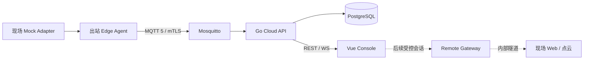

# 总体架构

采用 Monorepo + Go 模块化单体。Cloud API 同一进程承担鉴权、设备、Shadow、遥测、告警、租约、远程与审计模块。首期内存 Shadow + PostgreSQL，无额外缓存服务。

```mermaid
flowchart LR
  Mock[现场 Mock Adapter] --> Edge[出站 Edge Agent]
  Edge -->|MQTT 5 / mTLS| Broker[Mosquitto]
  Broker --> Cloud[Go Cloud API]
  Cloud --> DB[(PostgreSQL)]
  Cloud -->|REST / WS| Web[Vue Console]
  Web -.后续受控会话.-> Gateway[Remote Gateway]
  Gateway -.内部隧道.-> Local[现场 Web / 点云]
```

外部只经 Nginx/API；开发主机端口仅绑定 loopback。Gateway 当前拒绝业务访问，FRP 不启动。点云和本地 Web 都不通过 MQTT。
